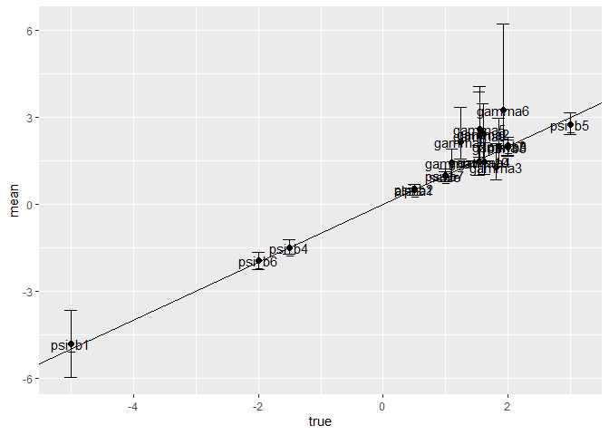

# Multiple Discrete-Continuous Extreme Value (MDCEV) Model Estimation and Simulation in R: The rmdcev Package

<!-- badges: start -->

[](https://travis-ci.org/plloydsmith/rmdcev)
<!-- badges: end -->

The *rmdcev* R package estimates and simulates multiple
discrete-continuous extreme value (MDCEV) demand models with observed
and unobserved individual heterogneity. Fixed parameter, latent class,
and random parameter models can be estimated. These models are estimated
using maximum likelihood or Bayesian estimation techniques and are
implemented in Stan, which is a C++ package for performing full Bayesian
inference (see <http://mc-stan.org/>). The package also includes
functions for simulating demand and welfare outcomes from policy
scenarios.

## Current Status

Development is in progress. Currently users can estimate the following
models:

1.  Fixed parameter models (maximum likelihood or Bayesian estimation)
2.  Latent class models (maximum likelihood estimation)
3.  Random parameters models (Bayesian estimation)

Under development

2.  Phaneuf/von Haefen Kuhn Tucker model

## Installation

I recommend you first install **rstan** and C++ toolchain by following
these steps:

<https://github.com/stan-dev/rstan/wiki/RStan-Getting-Started>

Once **rstan** is installed, you can install the released version of
rmdcev from GitHub using devtools

``` r
if (!require(devtools)) {
  install.packages("devtools")
  library(devtools)
}
install_github("plloydsmith/rmdcev", build_vignettes = FALSE)
```

Depending on your computer set-up, you may need to adjust your Makevars
file of the .R folder (usually in your computer user folder) to ensure
the first two lines are

``` r
CXX14 = $(BINPREF)g++ -m$(WIN) -std=c++1y
CXX14FLAGS=-O3 -mtune=native -march=native
```

You can switch build\_vignettes to TRUE but it will take a lot longer to
install. If installation fails, please let me know by [filing an
issue](https://github.com/plloydsmith/rmdcev/issues).

## References

For more details on the model specification and estimation:

Bhat, C.R. (2008) [“The Multiple Discrete-Continuous Extreme Value
(MDCEV) Model: Role of Utility Function Parameters, Identification
Considerations, and Model
Extensions.”](https://www.sciencedirect.com/science/article/pii/S0191261507000677)
Transportation Research Part B, 42(3): 274-303.

For more details on the welfare simulation:

Lloyd-Smith, P (2018). [“A New Approach to Calculating Welfare Measures
in Kuhn-Tucker Demand
Models.”](https://www.sciencedirect.com/science/article/pii/S1755534517300994)
Journal of Choice Modeling, 26: 19-27

## Estimation

As an example, we can simulate some data using the Hybrid specification.
In this example, we are simulating data for 1000 invdividuals and 10
non-numeraire alternatives.

``` r
library(pacman)
p_load(tidyverse, rmdcev)
model <- "hybrid"
nobs <- 1000
nalts <- 10
sim.data <- GenerateMDCEVData(model = model, nobs = nobs, nalts = nalts)
#> Checking data...
#> Data is good
```

Estimate model using MLE

``` r
mdcev_est <- mdcev(~ b1 + b2 + b3 + b4 + b5 + b6 + b7 + b8-1,
                   data = sim.data$data,
                   model = model,
                   algorithm = "MLE")
#> Using MLE to estimate MDCEV
#> Chain 1: Initial log joint probability = -8338.85
#> Chain 1:     Iter      log prob        ||dx||      ||grad||       alpha      alpha0  # evals  Notes 
#> Chain 1:       19      -6795.15      0.140211       50.3362      0.8093      0.8093       24   
#> Chain 1:     Iter      log prob        ||dx||      ||grad||       alpha      alpha0  # evals  Notes 
#> Chain 1:       39      -6762.29      0.356692       42.4055           1           1       47   
#> Chain 1:     Iter      log prob        ||dx||      ||grad||       alpha      alpha0  # evals  Notes 
#> Chain 1:       59      -6759.29    0.00781943       7.75894      0.8702      0.8702       68   
#> Chain 1:     Iter      log prob        ||dx||      ||grad||       alpha      alpha0  # evals  Notes 
#> Chain 1:       79      -6758.49     0.0310257       3.61061       0.653       0.653       89   
#> Chain 1:     Iter      log prob        ||dx||      ||grad||       alpha      alpha0  # evals  Notes 
#> Chain 1:       99      -6758.38    0.00227435       1.00926           1           1      109   
#> Chain 1:     Iter      log prob        ||dx||      ||grad||       alpha      alpha0  # evals  Notes 
#> Chain 1:      115      -6758.38   0.000242637      0.158441           1           1      127   
#> Chain 1: Optimization terminated normally: 
#> Chain 1:   Convergence detected: relative gradient magnitude is below tolerance
```

Summarize results

``` r
summary(mdcev_est)
#> Model run using rmdcev for R, version 1.1.0 
#> Estimation method                : MLE
#> Model type                       : hybrid specification
#> Number of classes                : 1
#> Number of individuals            : 499
#> Number of non-numeraire alts     : 10
#> Estimated parameters             : 20
#> LL                               : -6758.38
#> AIC                              : 13556.76
#> BIC                              : 13641.01
#> Standard errors calculated using : 50 MVN draws
#> Exit of MLE                      : successful convergence
#> Time taken (hh:mm:ss)            : 00:00:0.74
#> 
#> Average consumption of non-numeraire alternatives:
#>     1     2     3     4     5     6     7     8     9    10 
#> 19.81 17.18  8.63 19.37  5.43 26.76  6.65 20.98 31.94  8.45 
#> 
#> Parameter estimates --------------------------------  
#>         Estimate Std.err z.stat
#> psi_b1    -5.525   0.866  -6.38
#> psi_b2     0.668   0.131   5.10
#> psi_b3     1.991   0.207   9.61
#> psi_b4    -1.262   0.133  -9.49
#> psi_b5     3.170   0.277  11.44
#> psi_b6    -2.147   0.183 -11.75
#> psi_b7     0.869   0.106   8.20
#> psi_b8     2.174   0.190  11.46
#> gamma1     2.062   0.546   3.77
#> gamma2     1.045   0.184   5.68
#> gamma3     1.299   0.423   3.07
#> gamma4     2.209   0.616   3.59
#> gamma5     1.472   0.328   4.49
#> gamma6     1.457   0.256   5.70
#> gamma7     2.447   0.764   3.20
#> gamma8     1.527   0.337   4.53
#> gamma9     1.153   0.224   5.16
#> gamma10    1.306   0.310   4.22
#> alpha1     0.486   0.040  12.15
#> scale      1.000   0.070  14.20
#> Note: Alpha parameter is equal for all alternatives.
```

Compare estimates to true values

``` r
parms_true <- tbl_df(sim.data$parms_true) %>%
    mutate(true = as.numeric(true))

output <- tbl_df(mdcev_est[["stan_fit"]][["theta_tilde"]]) %>%
                dplyr::select(-tidyselect::starts_with("log_like"),         
                              -tidyselect::starts_with("sum_log_lik"))

names(output)[1:mdcev_est$parms_info$n_vars$n_parms_total] <- mdcev_est$parms_info$parm_names$all_names

output<- output %>%
        tibble::rowid_to_column("sim_id") %>%
        tidyr::gather(parms, value, -sim_id)

coefs <- output %>%
    mutate(parms = gsub("\\[|\\]", "", parms)) %>%
    group_by(parms) %>%
    summarise(mean = mean(value),
              sd = sd(value),
              zstat = mean / sd,
              cl_lo = quantile(value, 0.025),
              cl_hi = quantile(value, 0.975)) %>%
    left_join(parms_true, by = "parms") %>%
    print(n=200)
#> # A tibble: 20 x 7
#>    parms     mean     sd  zstat  cl_lo  cl_hi  true
#>    <chr>    <dbl>  <dbl>  <dbl>  <dbl>  <dbl> <dbl>
#>  1 alpha1   0.486 0.0400  12.1   0.421  0.552  0.5 
#>  2 gamma1   2.06  0.546    3.77  1.33   3.28   1.63
#>  3 gamma10  1.31  0.310    4.22  0.898  2.01   1.23
#>  4 gamma2   1.04  0.184    5.68  0.778  1.49   1.46
#>  5 gamma3   1.30  0.423    3.07  0.758  2.18   1.79
#>  6 gamma4   2.21  0.616    3.59  1.20   2.92   1.95
#>  7 gamma5   1.47  0.328    4.49  0.907  2.01   1.30
#>  8 gamma6   1.46  0.256    5.70  1.02   1.89   1.62
#>  9 gamma7   2.45  0.764    3.20  1.47   3.81   1.76
#> 10 gamma8   1.53  0.337    4.53  1.02   2.22   1.69
#> 11 gamma9   1.15  0.224    5.16  0.822  1.58   1.35
#> 12 psi_b1  -5.53  0.866   -6.38 -6.83  -4.08  -5   
#> 13 psi_b2   0.668 0.131    5.10  0.385  0.872  0.5 
#> 14 psi_b3   1.99  0.207    9.61  1.56   2.31   2   
#> 15 psi_b4  -1.26  0.133   -9.49 -1.55  -1.07  -1.5 
#> 16 psi_b5   3.17  0.277   11.4   2.69   3.61   3   
#> 17 psi_b6  -2.15  0.183  -11.8  -2.48  -1.88  -2   
#> 18 psi_b7   0.869 0.106    8.20  0.668  1.06   1   
#> 19 psi_b8   2.17  0.190   11.5   1.85   2.47   2   
#> 20 scale    1.00  0.0705  14.2   0.894  1.15   1
```

Compare outputs using a figure

``` r
coefs %>%
    ggplot(aes(y = mean, x = true))  +
    geom_point(size=2) +
    geom_text(label=coefs$parms) +
    geom_abline(slope = 1) +
    geom_errorbar(aes(ymin=cl_lo,ymax=cl_hi,width=0.2))
```



## Welfare simulation

Create policy simulations (these are ‘no change’ policies with no
effects)

``` r
npols <- 2 # Choose number of policies

policies<-  CreateBlankPolicies(npols, nalts, mdcev_est$stan_data[["dat_psi"]], price_change_only = TRUE)

df_sim <- PrepareSimulationData(mdcev_est, policies)
```

Simulate welfare changes

``` r
wtp <- mdcev.sim(df_sim$df_indiv, df_common = df_sim$df_common, sim_options = df_sim$sim_options,
                     cond_err = 1, nerrs = 5, sim_type = "welfare")
#> Using hybrid approach to simulation
#> Compiling simulation code
#> Simulating welfare...
#> 
#> 1.50e+05simulations finished in0.04minutes.(69628per second)
summary(wtp)
#> # A tibble: 2 x 5
#>   policy      mean  std.dev `ci_lo2.5%` `ci_hi97.5%`
#>   <chr>      <dbl>    <dbl>       <dbl>        <dbl>
#> 1 policy1 7.20e-12 7.58e-11   -9.86e-11     1.71e-10
#> 2 policy2 7.20e-12 7.58e-11   -9.86e-11     1.71e-10
```
