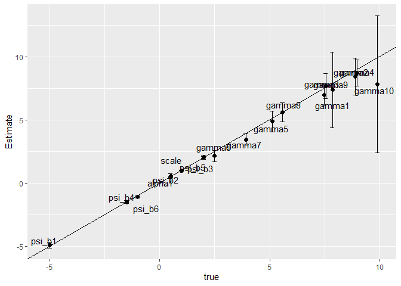

# Multiple Discrete-Continuous Extreme Value (MDCEV) Model Estimation and Simulation in R: The rmdcev Package

<!-- badges: start -->

[](https://travis-ci.org/plloydsmith/rmdcev)
<!-- badges: end -->

The *rmdcev* R package estimates and simulates multiple
discrete-continuous extreme value (MDCEV) demand models with observed
and unobserved individual heterogneity. Fixed parameter, latent class,
and random parameter models can be estimated. These models are estimated
using maximum likelihood or Bayesian estimation techniques and are
implemented in Stan, which is a C++ package for performing full Bayesian
inference (see <http://mc-stan.org/>). The package also includes
functions for simulating demand and welfare outcomes from policy
scenarios.

## Current Status

Development is in progress. Currently users can estimate the following
models:

1.  Bhat (2008) MDCEV model specifications
2.  Kuhn-Tucker model specification (von Haefen and Phaneuf, 2005)

Models can be estimated using

1.  Fixed parameter models (maximum likelihood or Bayesian estimation)
2.  Latent class models (maximum likelihood estimation)
3.  Random parameters models (Bayesian estimation)

## Installation

I recommend you first install **rstan** and C++ toolchain by following
these steps:

<https://github.com/stan-dev/rstan/wiki/RStan-Getting-Started>

Once **rstan** is installed, you can install the released version of
rmdcev from GitHub using devtools

``` r
if (!require(devtools)) {
  install.packages("devtools")
  library(devtools)
}
install_github("plloydsmith/rmdcev", build_vignettes = FALSE, INSTALL_opts="--no-multiarch")
```

You can switch build\_vignettes to TRUE but it will take a lot longer to
install. If installation fails, please let me know by [filing an
issue](https://github.com/plloydsmith/rmdcev/issues).

## References

For more details on the model specification and estimation:

Bhat, C.R. (2008) [“The Multiple Discrete-Continuous Extreme Value
(MDCEV) Model: Role of Utility Function Parameters, Identification
Considerations, and Model
Extensions”](https://www.sciencedirect.com/science/article/pii/S0191261507000677)
Transportation Research Part B, 42(3): 274-303.

von Haefen, R. and Phaneuf D. (2005) [“Kuhn-Tucker Demand System
Approaches to Non-Market
Valuation”](https://link.springer.com/chapter/10.1007/1-4020-3684-1_8)
In: Scarpa R., Alberini A. (eds) Applications of Simulation Methods in
Environmental and Resource Economics. The Economics of Non-Market Goods
and Resources, vol 6. Springer, Dordrecht.

For more details on the welfare simulation:

Lloyd-Smith, P (2018). [“A New Approach to Calculating Welfare Measures
in Kuhn-Tucker Demand
Models.”](https://www.sciencedirect.com/science/article/pii/S1755534517300994)
Journal of Choice Modeling, 26: 19-27

## Estimation

As an example, we can simulate some data using Bhat (2008)‘s ’Gamma’
specification. In this example, we are simulating data for 2,000
individuals and 10 non-numeraire alternatives. We will randomly generate
the parameter values to simulate the data and then check these values to
our estimation results.

``` r
library(pacman)
p_load(tidyverse, rmdcev)
model <- "gamma"
nobs <- 2000
nalts <- 10
sim.data <- GenerateMDCEVData(model = model, nobs = nobs, nalts = nalts)
#> Sorting data by id.var then alt...
#> Checking data...
#> Data is good
```

Estimate model using MLE (note that we set “psi\_ascs = 0” to omit any
alternative-specific constants)

``` r
mdcev_est <- mdcev(~ b1 + b2 + b3 + b4 + b5 + b6,
                   data = sim.data$data,
                   psi_ascs = 0,
                   model = model,
                   algorithm = "MLE")
#> Using MLE to estimate KT model
#> Chain 1: Initial log joint probability = -91048
#> Chain 1:     Iter      log prob        ||dx||      ||grad||       alpha      alpha0  # evals  Notes 
#> Chain 1: Error evaluating model log probability: Non-finite gradient.
#> Error evaluating model log probability: Non-finite gradient.
#> 
#> Chain 1:       19      -34017.1      0.828389        593.03           1           1       31   
#> Chain 1:     Iter      log prob        ||dx||      ||grad||       alpha      alpha0  # evals  Notes 
#> Chain 1:       39      -33883.5     0.0486262       41.9233       1.362      0.1362       54   
#> Chain 1:     Iter      log prob        ||dx||      ||grad||       alpha      alpha0  # evals  Notes 
#> Chain 1:       59      -33879.1    0.00342063       5.98227           1           1       76   
#> Chain 1:     Iter      log prob        ||dx||      ||grad||       alpha      alpha0  # evals  Notes 
#> Chain 1:       79      -33879.1   0.000905567      0.741452      0.8561      0.8561      100   
#> Chain 1:     Iter      log prob        ||dx||      ||grad||       alpha      alpha0  # evals  Notes 
#> Chain 1:       81      -33879.1   0.000653699      0.595676           1           1      102   
#> Chain 1: Optimization terminated normally: 
#> Chain 1:   Convergence detected: relative gradient magnitude is below tolerance
```

Summarize results

``` r
summary(mdcev_est)
#> Model run using rmdcev for R, version 1.1.2 
#> Estimation method                : MLE
#> Model type                       : gamma specification
#> Number of classes                : 1
#> Number of individuals            : 2000
#> Number of non-numeraire alts     : 10
#> Estimated parameters             : 18
#> LL                               : -33879.07
#> AIC                              : 67794.13
#> BIC                              : 67894.95
#> Standard errors calculated using : Delta method
#> Exit of MLE                      : successful convergence
#> Time taken (hh:mm:ss)            : 00:00:2.68
#> 
#> Average consumption of non-numeraire alternatives:
#>     1     2     3     4     5     6     7     8     9    10 
#>  1.55 18.19 13.73  3.39 11.99 40.21 14.11  2.83 20.17  2.07 
#> 
#> Parameter estimates --------------------------------  
#>          Estimate Std.err z.stat
#> psi_b1     -4.955   0.113 -43.85
#> psi_b2      0.407   0.073   5.58
#> psi_b3      1.961   0.077  25.47
#> psi_b4     -1.475   0.056 -26.34
#> psi_b5      1.987   0.049  40.55
#> psi_b6     -1.092   0.053 -20.61
#> gamma_1     3.927   0.547   7.18
#> gamma_2     2.233   0.134  16.66
#> gamma_3     3.674   0.249  14.76
#> gamma_4     6.684   0.746   8.96
#> gamma_5     4.160   0.280  14.86
#> gamma_6     9.207   0.562  16.38
#> gamma_7     7.316   0.529  13.83
#> gamma_8     2.641   0.245  10.78
#> gamma_9     4.042   0.252  16.04
#> gamma_10    6.447   0.954   6.76
#> alpha_1     0.487   0.008  60.84
#> scale       0.999   0.016  62.46
#> Note: All non-numeraire alpha's fixed to 0.
```

Compare estimates to true values

``` r
coefs <- as_tibble(sim.data$parms_true) %>%
    mutate(true = as.numeric(true)) %>%
 cbind(summary(mdcev_est)[["CoefTable"]]) %>%
    mutate(cl_lo = Estimate - 1.96 * Std.err,
           cl_hi = Estimate + 1.96 * Std.err)

head(coefs, 200)
#>      parms      true Estimate Std.err z.stat    cl_lo    cl_hi
#> 1   psi_b1 -5.000000   -4.955   0.113 -43.85 -5.17648 -4.73352
#> 2   psi_b2  0.500000    0.407   0.073   5.58  0.26392  0.55008
#> 3   psi_b3  2.000000    1.961   0.077  25.47  1.81008  2.11192
#> 4   psi_b4 -1.500000   -1.475   0.056 -26.34 -1.58476 -1.36524
#> 5   psi_b5  2.000000    1.987   0.049  40.55  1.89096  2.08304
#> 6   psi_b6 -1.000000   -1.092   0.053 -20.61 -1.19588 -0.98812
#> 7   gamma1  4.203510    3.927   0.547   7.18  2.85488  4.99912
#> 8   gamma2  2.317260    2.233   0.134  16.66  1.97036  2.49564
#> 9   gamma3  3.816600    3.674   0.249  14.76  3.18596  4.16204
#> 10  gamma4  6.724763    6.684   0.746   8.96  5.22184  8.14616
#> 11  gamma5  3.891834    4.160   0.280  14.86  3.61120  4.70880
#> 12  gamma6  9.380593    9.207   0.562  16.38  8.10548 10.30852
#> 13  gamma7  7.656471    7.316   0.529  13.83  6.27916  8.35284
#> 14  gamma8  2.440941    2.641   0.245  10.78  2.16080  3.12120
#> 15  gamma9  3.874010    4.042   0.252  16.04  3.54808  4.53592
#> 16 gamma10  5.907231    6.447   0.954   6.76  4.57716  8.31684
#> 17  alpha1  0.500000    0.487   0.008  60.84  0.47132  0.50268
#> 18   scale  1.000000    0.999   0.016  62.46  0.96764  1.03036
```

Compare outputs using a figure

``` r
coefs %>%
    ggplot(aes(y = Estimate, x = true))  +
    geom_point(size=2) +
    geom_text(label=coefs$parms,position=position_jitter(width=.5,height=1)) +
    geom_abline(slope = 1) +
    geom_errorbar(aes(ymin=cl_lo,ymax=cl_hi,width=0.2))
```



## Welfare simulation

Create policy simulations (these are ‘no change’ policies with no
effects)

``` r
npols <- 2 # Choose number of policies

policies<-  CreateBlankPolicies(npols, nalts, mdcev_est$stan_data[["dat_psi"]])

df_sim <- PrepareSimulationData(mdcev_est, policies, nsims = 1) 
```

Simulate welfare changes

``` r
wtp <- mdcev.sim(df_sim$df_indiv, 
                 df_common = df_sim$df_common, 
                 sim_options = df_sim$sim_options,
                 cond_err = 1, 
                 nerrs = 15, 
                 sim_type = "welfare")
#> Using general approach in simulation...
#> 
#> 6.00e+04simulations finished in0.33minutes.(3049per second)
summary(wtp)
#> # A tibble: 2 x 5
#>   policy       mean std.dev `ci_lo2.5%` `ci_hi97.5%`
#>   <chr>       <dbl>   <dbl>       <dbl>        <dbl>
#> 1 policy1 -1.35e-11      NA   -1.35e-11    -1.35e-11
#> 2 policy2 -1.35e-11      NA   -1.35e-11    -1.35e-11
```
